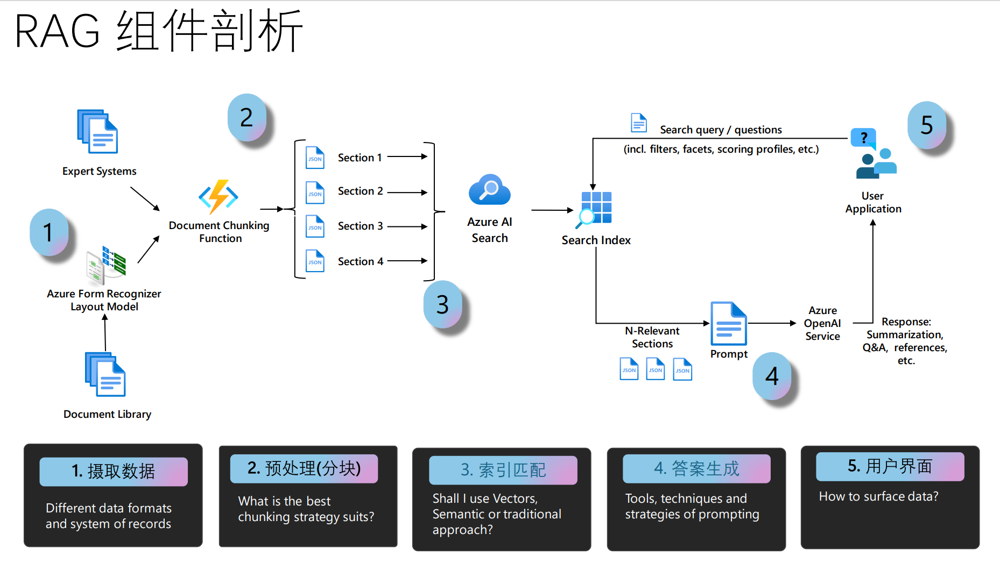

# Azure AI Search RAG入门

这是一个简单的入门示例，用于演示如何使用Azure AI Search的RAG功能。 本教程将向您展示如何使用Azure AI Search的RAG功能来回答有关文档的问题。

- 基于中文的RAG测试 : [03-AI_Search_RAG_cn](./notebook/03-AI_Search_RAG_cn.ipynb)

- 从零开始建index和问答示例: [01-azure-search-vector-python-sample](./notebook/01-azure-search-vector-python-sample_cn.ipynb)
- 使用skillset和indexder来构建索引和问答示例: [02-azure-search-integrated-vectorization-sample_cn](./notebook/02-azure-search-integrated-vectorization-sample_cn.ipynb)
